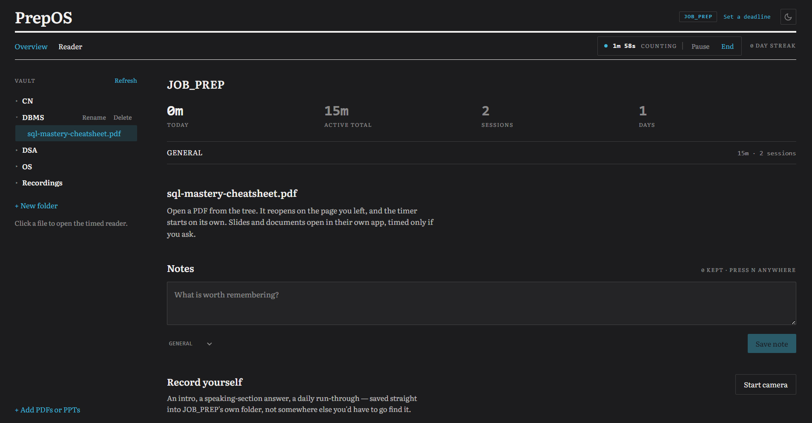
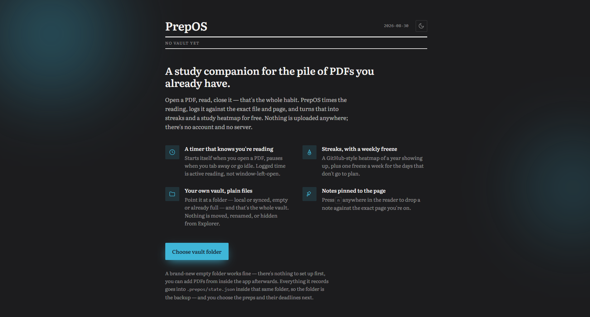

# PrepOS

A local-first study companion for Windows: a timed PDF reader, streaks, a
study heatmap, per-page notes and camera practice — all built on top of a
plain folder you already own. Nothing is uploaded anywhere; there's no
account and no server.

**[Download the latest installer](https://github.com/prajwal-priyadarshan/PrepOS/releases/latest)**
&middot; [website source](website/)



*What you see before you've pointed it at a folder &mdash; no vault, no account, nothing to set up first:*



## Use case

If you're preparing for something over weeks or months — a competitive exam,
a job interview loop, a certification, a course endsem — the material for it
is usually a pile of PDFs and slides scattered across folders, and the actual
proof that you're putting in the hours lives nowhere: not in a study-tracker
app you stopped opening, not in a spreadsheet you meant to keep updating.

PrepOS is built around one habit instead: **open the PDF, read, close it.**
That alone is enough to get a logged, honest sitting — active time only, tied
to the exact file and page — without asking you to separately "start a
timer" or "log a session" anywhere. Do that daily and streaks, a study
heatmap and per-prep stats fall out of it for free.

It was originally built for one CAT aspirant tracking a single exam's prep;
it's now general enough to run several unrelated preps side by side — say,
a DBMS endsem and a job-interview loop at the same time — each with its own
vault folder, its own deadline, its own stats, switched from one dashboard.

It is **not** trying to be a note-taking app, a spaced-repetition system, or
a flashcard tool — there are good ones of those already. It's the layer
underneath: the vault your material already lives in, read honestly, with
nothing asked of you except opening the file.

## What it does

- **Your own vault.** Point PrepOS at a folder — local or synced through
  OneDrive, empty or already full of PDFs — and that's the whole vault. Every
  file it manages is a plain file you can see in Explorer.
- **A timer that knows you're reading.** Open a PDF and the clock starts on
  its own; it pauses when the window is hidden or you've gone idle, so the
  logged time is active reading time, not "window left open."
- **Streaks with a weekly freeze.** A qualifying day extends the streak; one
  freeze a week bridges a bad day without lying about it. A GitHub-style
  heatmap shows a year of showing up at a glance.
- **One workspace per prep.** An exam, an interview, a certification —
  anything you're working toward gets its own folder, its own stats, and
  optionally a deadline countdown.
- **Notes pinned to the page.** Press `n` anywhere in the reader to drop a
  note against the exact page you're on.
- **Camera practice**, streamed straight to disk inside that prep's own
  folder — an intro, a speaking-section answer, a daily run-through.
- **Zoom, fullscreen, and scroll-to-turn-the-page** in the reader, tuned to
  stay usable even on a 1000+ page scanned PDF.
- **Light, Dark and Black themes**, following the system by default.

## Installing

Go to the [latest release](https://github.com/prajwal-priyadarshan/PrepOS/releases/latest)
and, under **Assets**, download `PrepOS_<version>_x64-setup.exe` (or the `.msi`
if you prefer Windows' own installer format). Run it — that's it, no account,
no setup wizard. The first launch asks for a folder to use as your vault and
remembers it after that — a brand-new empty folder works fine, there's
nothing to set up in it first; you can add PDFs from inside the app
afterwards.

Don't use the "Source code (zip)" link near the bottom of Assets — that's the
repository's source, not something you can run.

Windows SmartScreen may flag the installer since it isn't code-signed; click
**More info → Run anyway** to proceed.

## Tech stack

<p>
  
  
  
  
  
  
  
  
</p>

A [Tauri](https://tauri.app) app: a React/TypeScript front end (Vite,
Tailwind CSS, Zustand for state) over a small Rust shell. `react-pdf` runs the
reader, Recharts draws the heatmap, `date-fns` handles the calendar math.
Vitest runs the test suite and Biome does formatting and linting — no ESLint
or Prettier in the mix.

## Building from source

PrepOS is a [Tauri](https://tauri.app) app: a React/TypeScript front end over
a small Rust shell.

**Prerequisites:** Node.js 20+, the
[Rust toolchain](https://www.rust-lang.org/tools/install), and Tauri's
[Windows prerequisites](https://tauri.app/start/prerequisites/) (the MSVC
Build Tools and the WebView2 runtime — WebView2 ships with Windows 11 by
default).

```sh
git clone https://github.com/prajwal-priyadarshan/PrepOS.git
cd PrepOS
npm install

npm run dev          # run the app in development (Vite + Tauri, hot-reloading)
npm run tauri build  # produce a Windows installer
```

The built installer(s) land in `src-tauri/target/release/bundle/` — an NSIS
`.exe` and an MSI, ready to run.

Other useful scripts:

```sh
npm test      # run the test suite (vitest)
npm run lint  # check formatting and lint rules (biome)
```

## Project structure

```
src/                  React app
  features/           one folder per feature area (reader, vault, preps,
                       stats, recorder, notes, settings)
  store/               zustand stores
  lib/                 pure logic - session clocks, streaks, the study-day
                       boundary, stats - independently unit tested
  vault/               the one seam between the app and the filesystem;
                       everything outside it is Tauri-agnostic
src-tauri/             the Rust shell (window, filesystem plugin config, bundling)
tests/                 vitest unit tests for src/lib and the vault seam
website/               the static marketing site published from /website
```

## License

Not yet decided — treat this as all-rights-reserved until a license file is
added.
